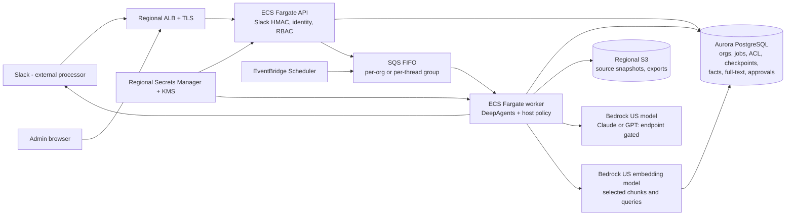

# Proposal: Company Brain–like product on AWS with DeepAgents

Status: design for review, not an implemented or deployed system. Reference: Supermemory Company Brain at pinned revision `d76cc1c9cc4fbddaf95f3a560edcaa04001c4dee`.[1]

## 1. Recommendation and hard boundary

Build a Slack-first organizational assistant on AWS, using DeepAgents as the **conversation/tool-loop runtime**, not as the authorization system, scheduler, document database or memory-quality engine. Keep a platform-owned API, job orchestration, ACL-aware knowledge service and audit trail around it. Use **Jakarta (`ap-southeast-3`) for application state and storage**, while explicitly allowing model and embedding inference in **US AWS Region(s)**. This is the user's clarified boundary, not a single-region architecture. All model and embedding inference must go through Amazon Bedrock. Direct OpenAI and Anthropic APIs are outside the approved design, including as automatic fallbacks; an incompatible Bedrock endpoint is a feasibility blocker to resolve with another Bedrock-supported model or adapter. Slack remains an external SaaS processor, so “everything inside AWS” is impossible for this Slack-based product. Avoid `global.*` Bedrock inference profiles when the intent is specifically US processing; use an in-Region US endpoint or a `us.*` profile and record its possible US destination Regions. Calling a Jakarta endpoint does not mean computation stayed there.[7][14][15]

Target experience: invite a Slack bot; it observes eligible public conversations, answers questions from approved knowledge with citations, respects DM/private-channel visibility, asks before consequential actions, and eventually performs scheduled nudges and connected-app work. A browser console supports setup, roles, knowledge review/correction, integrations and audit. Aim for behavioral similarity, **not a source-compatible port**. The reference combines a Cloudflare Worker, one DO per organization, D1/KV and externally hosted Supermemory; DeepAgents brings a different runtime and a distinct filesystem-style memory model.[1][2][4]

## 2. What is feasible versus not yet proven

| Capability | Proposed AWS/DeepAgents route | Confidence and honest gap |
|---|---|---|
| Slack mention → answer | ALB → Fargate API verifies Slack signature, persists event, queues run; Fargate worker invokes DeepAgents and posts answer | Feasible architecture. Slack delivery and reply are not one atomic transaction; duplicates/ambiguous post results need reconciliation. |
| Agent reasoning, tool calls and approvals | DeepAgents `create_deep_agent`, custom tools and `interrupt_on` with database checkpointer; host policy validates identity, tenant, side effect and approved args again on resume | Runtime features documented; exact SDK + model combination and interruption behavior must be exercised, not assumed.[2][5][6] |
| Durable conversations | LangGraph Postgres checkpointer in Aurora PostgreSQL, with stable thread IDs and tenant-to-thread mapping in application tables | Supported Postgres integration, but Aurora compatibility/connection capacity and recovery under worker death are acceptance tests.[3][6][13] |
| Scoped long-term company knowledge | Use DeepAgents `StoreBackend` for small curated agent/user/org memory files and procedures; use S3 source snapshots plus Aurora PostgreSQL for versioned facts/chunks/ACL/audit, text search and later `pgvector` | **Partial replacement, not turnkey Supermemory parity.** DeepAgents supplies persistent file-shaped memory and namespace routing, but not a verified pipeline for Slack extraction, evidence-linked claims, hybrid retrieval, contradiction/review, private-channel ACLs and deletion. Build those as platform services and expose them as tools.[4][10] |
| US-hosted model via Bedrock | Keep Jakarta worker/DB; call a selected US Bedrock endpoint/model. Candidate: Claude Sonnet 5 via US geo profile on `bedrock-runtime`, or single-Region `us-east-1` via `bedrock-mantle`; GPT-6 Sol also lists single-Region `us-east-1` on `bedrock-mantle` | **Model is not selected until tested.** `bedrock-runtime` on these model cards does not offer direct single-Region calls for the bare model ID. US geo may route among US Regions; Mantle has different APIs from the familiar Converse integration. Test DeepAgents adapter, tool calling, latency, quotas, cost and data handling in account.[14][15][16] |
| Jakarta-hosted knowledge engine (no Bedrock Knowledge Bases) | Aurora PostgreSQL with built-in full-text search and the open-source `pgvector` extension, private S3 source snapshots, and Fargate ingestion workers; optional Docling on Fargate for uploaded PDFs/docs | This is an application-owned pipeline, not a managed Bedrock KB. Verify `vector` extension/engine version in Jakarta. Slack messages need no document parser. `pgvector` performs similarity search but not evidence validation, ACL policy or lifecycle by itself.[10][17][18] |
| US Bedrock embeddings with Jakarta index | Invoke a Bedrock embedding model in a supported US Region and store resulting vectors in Jakarta Aurora `pgvector`; combine PostgreSQL text and vector scores | Selected chunks and query text cross to the US on ingestion and search. Keeping vectors in Jakarta does not mean source text never left Jakarta. **Bedrock Knowledge Bases is excluded in every Region**, not used in the US as a workaround.[8][17] |
| Public-channel passive learning | Eligible Slack events → queue → candidate extraction → validation/review → published knowledge | Achievable with custom workers. Prompt/schema validation is not factual verification; review and corrections are product features, not optional polish. |
| DM/private-channel memory | Separate tenant/user/channel ACL, refresh membership from Slack before sensitive retrieval; deny private results if membership cannot be checked | Hard security work. Slack membership freshness and revocations cannot be solved by a vector filter alone. |
| Connected apps, schedules, proactive nudges, graph UI, code sandbox | Incremental adapters, EventBridge Scheduler, review workflows, optional isolated Fargate tasks | Not in initial slice; broad parity requires materially more engineering and testing than a single DeepAgents wrapper.[12] |

## 3. Proposed target architecture

The model and embedding arrows cross an AWS Region boundary. The three planes are: **control** (organization/role/credential/approval administration), **data** (source evidence, derived facts, checkpoints, ACLs), and **execution** (queued DeepAgents turns and isolated external tool work). The API verifies signatures and authenticates people; it does not trust a model-supplied org ID. Queue `MessageGroupId=org` gives safe initial serialization at the cost of throughput. Later, use thread groups plus explicit database locks for shared state. FIFO ordering is not end-to-end exactly-once: its deduplication window is limited and external Slack/tool effects require an idempotency ledger and reconciliation.[11]

Prefer one Aurora PostgreSQL cluster over several stores at first: application rows, LangGraph checkpoints, full-text search and later `pgvector` can coexist behind separated schemas/roles, provided workload isolation and backups are proven. Aurora PostgreSQL is available in Jakarta; exact engine/version, pgvector extension, serverless capacity, quotas and price must be checked in the deployment account. S3 is a source-evidence store, **not** a substitute for a scoped searchable index.[6][10][13]

### Knowledge implementation: open source in Jakarta, no Bedrock Knowledge Bases

This is **not** a Bedrock Knowledge Bases deployment. Bedrock is used only as the approved model/embedding inference API; our code owns `ingest`, `extract`, `review`, `index`, `retrieve`, `correct` and `delete`. The PostgreSQL full-text engine is built in; `pgvector` is open-source software running inside the Jakarta Aurora cluster. That satisfies “knowledge data and index hosted in Jakarta” without self-managing a second database. Aurora itself is managed AWS PostgreSQL—not a fully self-hosted OSS distribution—and the application still sends selected text to Bedrock US for LLM/embedding inference. Verify the exact Aurora engine's `vector` extension in the actual account before relying on it.[10][13][17]

- **Slack:** store only eligible message snapshots and source pointers under an explicit retention/consent policy; group related messages, run Bedrock extraction into candidate claims and validate against source spans. No generic PDF parser is needed for Slack text.
- **Files later:** put originals in private regional S3; optionally use OSS Docling in an isolated Jakarta Fargate ingestion worker to parse PDF/Office and retain page/section offsets for citations. OCR can be resource-heavy; budget CPU/memory and quarantine untrusted uploads.[19]
- **Search:** PostgreSQL `tsvector`/`tsquery` first; then add Bedrock-generated vectors to `pgvector` and combine lexical/semantic rankings. Enforce org, shared/channel/user visibility and live membership constraints in SQL **before** giving snippets to DeepAgents. Indexes accelerate search; they do not confer authorization. For small tenant-filtered sets, test exact vector ranking first; HNSW/IVFFlat approximate indexes can under-return after selective filters unless tuned or partitioned. Benchmark retrieval quality and filtered recall.[17][18]
- **Scale-out option, not default:** self-host Qdrant in Jakarta only when Aurora search throughput/filtered recall is measured insufficient. It adds another durable service, backup/restore and reconciliation path; payload filtering is useful but still not a substitute for server-side auth and membership checks. Keep Aurora authoritative for ACL/provenance even if vectors move to Qdrant.[20]

The explicit gap versus Supermemory remains the hard product logic: asynchronous extraction, dedupe/supersession, contradiction review, visibility and deletion across sources, claims and indexes. No OSS vector database provides that truth/permission layer by itself. DeepAgents' file memory holds curated instructions, not the entire Slack corpus.[1][4]

## 4. Exact flows and ownership

### A. Ask in Slack

1. Slack sends an event. API validates raw-body signature/timestamp, maps Slack team and user to an existing organization, rejects uninstalled/unknown teams, stores event ID and permitted conversation scope, queues a job, and acknowledges before doing model work.
2. Worker locks a run, fetches authorization context **server-side**, obtains only knowledge IDs the user may read, and assembles source-backed snippets. It passes opaque `org_id`, `user_id`, `thread_id` through trusted runtime context, never through model-controllable tool arguments.
3. DeepAgents calls only host-registered tools. A `search_knowledge` tool re-enforces ACL in SQL; the model sees cited snippets, not arbitrary storage paths. Read-only tools get explicit allowlists; writes become pending approvals bound to actor, exact arguments, expiry and capability.
4. On resume, the API validates the Slack approver and rechecks tenant, role, current channel membership, unchanged tool args and idempotency key. The worker executes once when possible and records outcome; after an uncertain network timeout, it reconciles rather than blindly repeating an external effect.
5. Post the answer with source links and a run marker. Treat a source link as provenance, **not proof the remembered claim is true**. Persist completion/audit and mask secrets/PII in logs.

DeepAgents documents `interrupt_on` and requires a checkpointer for human approval; it does not perform this product-specific authorization or exactly-once external effect protocol for us.[5][6]

### B. Add knowledge

```mermaid
flowchart LR
    E[Eligible Slack event or approved upload] --> Raw[S3 source snapshot + DB provenance]
    Raw --> Gate[Consent, source type, scope, retention gate]
    Gate --> Extract[Model proposes atomic claims with quote links]
    Extract --> Verify[Schema, source span, dedupe, contradiction,<br/>PII and ACL checks]
    Verify --> Review{Policy tier}
    Review -- Sensitive or disputed --> Human[Human review / reject]
    Review -- Low-risk --> Publish[Versioned published fact]
    Human -- Approve --> Publish
    Publish --> Index[Postgres text index; optional vectors]
    Index --> Query[ACL first, retrieve, cite and revalidate]
    Query --> Feedback[Correct / expire / delete]
    Feedback --> Publish
```

Each candidate stores `tenant_id`, `source_id`, Slack channel/time/message ID or document span, quoted evidence, visibility (`shared`, `channel`, `user`), claimant, extractor/model version, extraction time, valid-from/valid-until, review status, supersedes/contradicts pointers and deletion generation. Structural checks ensure a valid record and evidence span exists; they **cannot certify factual truth**. For high-impact policies/financial/legal assertions and private-to-shared promotion require review; otherwise label as unreviewed and expose a correction affordance. Deleting a source tombstones dependent facts, invalidates indexes/caches and rechecks backups/retention. Publish only when indexing succeeds or keep an explicit pending status. Never promote private-channel content into shared memory by summarizing it in a model prompt.[1][4]

DeepAgents' filesystem memory is useful for **curated agent preferences, working conventions and procedures** under per-user or per-org namespaces; a persistent StoreBackend can replace that *slice* of Supermemory. It is not by itself a trustworthy, ACL-aware search index for a company's Slack-derived facts. Keep bulk evidence and searchable claims in the platform-owned knowledge service and expose an authorized `search_knowledge` tool to DeepAgents. Its docs note last-write-wins conflicts on concurrent writes to a shared file; serialize or version such writes. The trusted knowledge store remains outside its memory files.[4]

## 5. Security, regionality, and operational constraints

- **Identity:** Slack OpenID for web login plus workspace-install verification; bootstrap owner through a time-limited admin claim/invite, never “first person to discover `/setup` owns the deployment.” On install callback enforce the same workspace invariant as sign-in.
- **Tenancy:** `org_id` on every row and S3 key; DB row-level security or mandatory repository predicates plus negative tests. Separate shared, channel and user visibility. Private-channel read authorization is checked against current membership; failure means no private result. Membership may lag until Slack reconciliation, so define a freshness budget and fail closed.
- **Model/tool boundary:** Treat Slack text, documents, MCP descriptions and retrieved passages as hostile instructions. Host-owned tool registry and policy; scoped delegated credentials; explicit approval for writes or unknown effects; deny arbitrary filesystem/shell by default. Run any necessary code in a disposable isolated execution environment, never in the API or shared worker.
- **Durability:** Aurora PITR/backups, S3 versioning and lifecycle, queue DLQ, retry budgets, checkpoint retention, outbox for outbound actions, replay-safe event IDs, encryption via regional KMS/Secrets Manager. Test restoration as a whole system, not just a database snapshot.
- **Region and processor inventory:** API, S3, Aurora, checkpoints, secrets and audit logs remain in Jakarta by design, while selected prompts, retrieved evidence and embedding input/query text travel to US Bedrock inference. Track which Bedrock model endpoint/profile processes each request. `us.*` can route across US Regions; `global.*` can route more broadly and is not an approved fallback. Direct OpenAI or Anthropic APIs are prohibited in this design. Slack and future SaaS MCP connectors remain external processors. Define retention/logging on both sides of the inference boundary and redact before sending when feasible.[7][14][15]
- **Cross-region reliability:** add per-request timeouts and a fail-closed policy for unavailable model/embedding calls; queue/defer ingestion rather than silently switching to a global or direct vendor endpoint. Cost analysis must include cross-region transfers and round-trip latency.
- **Cost:** Always-on ALB and Fargate, Aurora baseline, NAT/data egress, US Bedrock model and embedding tokens, cross-Region transfer/latency, S3 storage and queue operations are major cost drivers. No trustworthy monthly estimate exists without workload volume, instance choices, token distributions and an account-specific quote. Add per-org budgets, concurrency caps and circuit breakers before broad channel observation.

## 6. Explicit gaps / trade-offs

1. **Not a drop-in clone — high.** DO local scheduling/serialization and Supermemory extraction/search do not map one-to-one onto DeepAgents + Aurora. We must implement the coordinator, durable effects and knowledge lifecycle.
2. **US model integration — medium/high, feasibility gate.** Bedrock model cards distinguish endpoint APIs: Claude Sonnet 5 and GPT-6 Sol allow single-Region `us-east-1` via `bedrock-mantle`, while familiar `bedrock-runtime` routes use `us.*`/`global.*` profiles rather than direct single-Region bare IDs. Whether the chosen Bedrock endpoint works cleanly with the DeepAgents/LangChain tool loop must be proven in a spike. If the processing boundary later returns to Jakarta-only, Qwen3-Coder-30B-A3B-Instruct is a documented in-Region candidate, but its suitability for this non-coding agent is untested.[9] Do not equate `us.*` with one fixed US Region, or `global.*` with US-only.[14][15]
3. **Cross-border data path — high.** Prompts, retrieved snippets and embedding inputs may be sent from Jakarta to the US; this is an intentional privacy/legal/product trade-off, not just latency. Keep S3/DB in Jakarta, but disclose transit and model-provider handling to workspace owners. US embedding generation makes semantic search feasible without relocating the stored source and index; Bedrock Knowledge Bases is excluded entirely.[7][8]
4. **Truth and stale knowledge — high.** LLM extraction, schema validation, vector similarity and even human review do not guarantee truth. Provenance, review tiers, contradiction handling, TTL and corrections reduce risk, not eliminate it.
5. **Private-channel ACL freshness — high.** Slack membership changes and replayed checkpoints can leak data unless reauthorized at retrieval and resume; when Slack cannot be queried, withhold private results.
6. **External side effects — high.** SQS and Postgres can recover work, but Slack posts and third-party tool calls cannot join an AWS database transaction. Idempotency, visible outcomes and manual reconciliation remain necessary.[11]
7. **Feature parity — medium/high.** Passive learning, graph UI, automations, full Google/MCP connector library, proactive messages, sandbox and polished setup are separate product streams; the first vertical slice will not include all of them.[1]
8. **Provider independence — medium.** DeepAgents convenience features and LangGraph checkpoint schema can change. Pin versions, test upgrades and keep public run/event/approval/knowledge APIs framework-neutral.[2][3]
9. **Deployment validation — unresolved.** No AWS account deployment, model invocation, quota/price or live Slack integration was exercised for this proposal. Region/engine/model assumptions need in-account preflight before commitment.

## 7. Delivery phases and exit gates

**Gate 0 — feasibility and contracts.** Confirm which Bedrock US inference route is allowed (`us.*` profile across US Regions versus one `us-east-1` Mantle endpoint); direct vendor APIs are excluded. Confirm Slack scopes, data retention and estimated load. Define `Organization`, `Conversation`, `Run`, `Approval`, `Source`, `Claim`, `Visibility`, `Capability` and `AuditEvent` APIs plus threat model. Build a scored evaluation set from consented/sample conversations. Exit: at least one Claude or GPT model on Bedrock actually supports the DeepAgents tool loop, a US Bedrock embedding model produces vectors stored/retrieved in Jakarta Aurora, and prompts/evidence cross the documented US boundary only. Record quotas, latency and cost envelope; if the endpoint adapter fails, switch to another Bedrock-supported model or build a Bedrock adapter explicitly. Do not fall back to direct vendor or global routing.

**Phase 1 — read-only end-to-end slice.** ALB/API/Fargate/SQS/Aurora/S3, Slack install/mention, DB-backed DeepAgents checkpoint, scoped search over manually reviewed text records, citations and reply. Use PostgreSQL full-text first; add embedding/hybrid ranking after retrieval evaluation. Exit: duplicate event, restart mid-turn, cross-tenant query, revoked channel membership and replay tests pass; run audit visible in UI. This is an architecture proof, not feature parity.

**Phase 2 — knowledge lifecycle.** Public-channel observation with explicit channel allowlist, snapshots, candidate extraction, review queue, full-text search, revision/expiry/delete/export and measured answer quality. Add US Bedrock embedding calls and Jakarta `pgvector` indexing after technical and retrieval evaluation; Bedrock Knowledge Bases is not part of this design. Exit: seeded false/contradictory/private claims do not become unreviewed shared facts, and deletion removes query visibility within a documented bound.

**Phase 3 — governed actions and connectors.** One read-only connector and one approved write connector, policy engine, approval UI/Slack cards, durable resume and timeout reconciliation. Exit: unauthorized approver/replayed approval/changed arguments fail; crash after tool timeout cannot silently duplicate a consequential action.

**Phase 4 — broader product.** Scoped DMs/private channels, admin knowledge UI, scheduled nudges, more connectors, proactive behavior with rate/consent controls, and optionally isolated code execution. Exit: membership revocation, scheduler replay, multi-tenant isolation, red-team prompts, restoration and cost/run-budget drills pass.

## 8. Fixed decisions and remaining questions

1. The **US inference exception is accepted**. Is any US AWS Region acceptable through a `us.*` profile, or do you want one fixed Region (`us-east-1`) using an in-Region endpoint? I recommend starting with a US-only profile for compatibility, then evaluating a fixed-Region endpoint if needed.
2. **Bedrock-only is fixed:** direct OpenAI/Anthropic APIs and automatic provider fallback are out of scope. The implementation must prove the model/embedding route on Bedrock before proceeding. If neither selected Bedrock model/endpoint works with the required tool/approval semantics, stop at the feasibility gate and revisit the architecture with Irfan.
3. **Bedrock Knowledge Bases is excluded:** the knowledge engine is our Jakarta-hosted PostgreSQL full-text + OSS `pgvector` application service, not a managed KB in Jakarta or another Region.
4. Should automatic knowledge writes be review-first for everything, or tiered (low-risk auto-publish with a visible unreviewed label)? I recommend tiered only after measured false-memory and privacy tests.
5. What are the intended workspace size, ingestion volume, retention period and monthly spend ceiling? Needed before production capacity and cost commitments.

## Sources

[1] https://github.com/supermemoryai/company-brain/tree/d76cc1c9cc4fbddaf95f3a560edcaa04001c4dee
[2] https://docs.langchain.com/oss/python/deepagents/overview
[3] https://docs.langchain.com/oss/python/deepagents/going-to-production
[4] https://docs.langchain.com/oss/python/deepagents/memory
[5] https://docs.langchain.com/oss/python/deepagents/human-in-the-loop
[6] https://docs.langchain.com/oss/python/langgraph/add-memory
[7] https://docs.aws.amazon.com/bedrock/latest/userguide/models-region-compatibility.html
[8] https://docs.aws.amazon.com/bedrock/latest/userguide/knowledge-base-supported.html
[9] https://docs.aws.amazon.com/bedrock/latest/userguide/model-card-qwen-qwen3-coder-30b-a3b-instruct.html
[10] https://docs.aws.amazon.com/AmazonRDS/latest/AuroraUserGuide/AuroraPostgreSQL.VectorDB.html
[11] https://docs.aws.amazon.com/AWSSimpleQueueService/latest/SQSDeveloperGuide/sqs-fifo-queue-message-identifiers.html
[12] https://docs.aws.amazon.com/scheduler/latest/UserGuide/getting-started.html
[13] https://docs.aws.amazon.com/AmazonRDS/latest/AuroraUserGuide/Concepts.RegionsAndAvailabilityZones.html
[14] https://docs.aws.amazon.com/bedrock/latest/userguide/model-card-anthropic-claude-sonnet-5.html
[15] https://docs.aws.amazon.com/bedrock/latest/userguide/model-card-openai-gpt-6-sol.html
[16] https://docs.langchain.com/oss/python/deepagents/customization
[17] https://github.com/pgvector/pgvector
[18] https://www.postgresql.org/docs/current/textsearch-controls.html
[19] https://docling-project.github.io/docling
[20] https://qdrant.tech/documentation/manage-data/multitenancy
