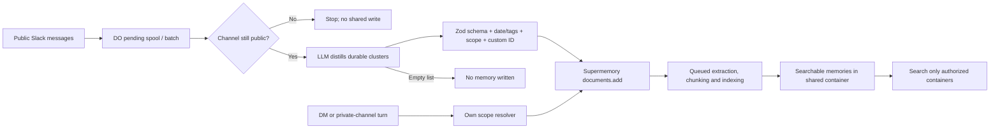
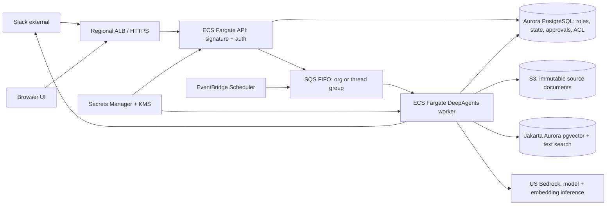

# Company Brain — technical deep dive

A code-first study of Supermemory’s open-sourced Slack agent. Reviewed at commit `d76cc1c9cc4fbddaf95f3a560edcaa04001c4dee` (September 27, 2026). This describes the checked-in implementation, not a deployed production assessment. [Repository](https://github.com/supermemoryai/company-brain/tree/d76cc1c9cc4fbddaf95f3a560edcaa04001c4dee).

> The central design move: use Slack as the interaction surface, a per-organization Durable Object as the long-running coordinator, D1 for identity and integration metadata, and scoped Supermemory containers for extracted long-term knowledge. This is open-source orchestration, not an offline/self-contained memory system: the [README](https://github.com/supermemoryai/company-brain/blob/d76cc1c9cc4fbddaf95f3a560edcaa04001c4dee/README.md#L99-L127) requires both Supermemory and model-provider API keys.

## 1. What problem is it solving?

Knowledge is scattered across conversations and systems; normal search requires someone to know where to look, and a generic chatbot lacks team-specific history and the authority to do follow-up work. Company Brain combines passive Slack observation, scoped memory extraction/retrieval, live connected-app tools, an approval-gated action loop, and scheduled/proactive work. The intended jobs include answering decisions and ownership questions, citing context, creating an issue or investigating a repo, and speaking up in a channel when useful. The [README's feature map](https://github.com/supermemoryai/company-brain/blob/d76cc1c9cc4fbddaf95f3a560edcaa04001c4dee/README.md#L34-L68) is a product claim; the [event router](https://github.com/supermemoryai/company-brain/blob/d76cc1c9cc4fbddaf95f3a560edcaa04001c4dee/src/routes/slack/index.ts#L738-L865), [agent shell](https://github.com/supermemoryai/company-brain/blob/d76cc1c9cc4fbddaf95f3a560edcaa04001c4dee/src/brain/turn/agent.ts#L81-L132) and [tool policy](https://github.com/supermemoryai/company-brain/blob/d76cc1c9cc4fbddaf95f3a560edcaa04001c4dee/src/brain/tools/mcp/policy.ts#L79-L185) demonstrate the corresponding mechanisms.

A useful mental model is **four planes**: (1) interaction: Slack + browser; (2) control: Worker + org-scoped Agent; (3) state: D1/KV/DO SQLite + Supermemory; (4) execution: model provider, MCP/Google/Slack tools and optional code sandbox. The Worker owns HTTP edges; the DO owns multi-step work. [Worker composition](https://github.com/supermemoryai/company-brain/blob/d76cc1c9cc4fbddaf95f3a560edcaa04001c4dee/src/worker.ts#L1-L54), [Cloudflare bindings](https://github.com/supermemoryai/company-brain/blob/d76cc1c9cc4fbddaf95f3a560edcaa04001c4dee/wrangler.jsonc#L1-L83).

## 2. System architecture

[Open the interactive architecture map](assets/system-map.html) (full-screen, searchable, light/dark, pan and zoom). It is a structural diagram; arrows omit some cross-cutting auth/control calls to keep the main path readable.

| Component | Responsibility | Evidence |
|---|---|---|
| Slack app | Events, mentions, DMs, channel history, OAuth install, interactive approval cards. Its requested scopes include message/history, read, posting, files and user information. | [Scopes and callbacks](https://github.com/supermemoryai/company-brain/blob/d76cc1c9cc4fbddaf95f3a560edcaa04001c4dee/src/routes/slack/index.ts#L67-L90), [handlers](https://github.com/supermemoryai/company-brain/blob/d76cc1c9cc4fbddaf95f3a560edcaa04001c4dee/src/routes/slack/index.ts#L535-L557) |
| React app | Sign-in, memory graph, configuration, integrations, automations and skills. Static build is served by the same Worker; `/brain/*` is its API. | [Worker routes](https://github.com/supermemoryai/company-brain/blob/d76cc1c9cc4fbddaf95f3a560edcaa04001c4dee/src/worker.ts#L39-L52), [assets config](https://github.com/supermemoryai/company-brain/blob/d76cc1c9cc4fbddaf95f3a560edcaa04001c4dee/wrangler.jsonc#L12-L27) |
| Hono Worker | Hydrates secrets, applies pending D1 migrations, sets session context and exposes setup/auth/brain/Slack routes. Verifies signed Slack requests and returns promptly while dispatching work with `waitUntil`. | [Worker bootstrap](https://github.com/supermemoryai/company-brain/blob/d76cc1c9cc4fbddaf95f3a560edcaa04001c4dee/src/worker.ts#L26-L52), [dispatch](https://github.com/supermemoryai/company-brain/blob/d76cc1c9cc4fbddaf95f3a560edcaa04001c4dee/src/routes/slack/index.ts#L816-L865) |
| CompanyBrainAgent DO | One keyed instance per org; orchestrates Slack turns, resumable fibers, approval decisions, scheduling, onboarding, automations, proactivity and memory operations. Heavy implementation is dynamically loaded. | [Agent shell/fibers](https://github.com/supermemoryai/company-brain/blob/d76cc1c9cc4fbddaf95f3a560edcaa04001c4dee/src/brain/turn/agent.ts#L81-L206), [methods](https://github.com/supermemoryai/company-brain/blob/d76cc1c9cc4fbddaf95f3a560edcaa04001c4dee/src/brain/turn/agent.ts#L637-L746) |
| Supermemory API | Stores extracted documents/memories and serves container-tagged search; not hosted in your Worker/D1. | [API client](https://github.com/supermemoryai/company-brain/blob/d76cc1c9cc4fbddaf95f3a560edcaa04001c4dee/src/memory/client.ts#L5-L20), [write scope](https://github.com/supermemoryai/company-brain/blob/d76cc1c9cc4fbddaf95f3a560edcaa04001c4dee/src/brain/memory/writeback.ts#L116-L125) |
| Tool/model layer | Selects provider, assembles personal/connected tools, classifies MCP calls by effect; write or ambiguous effects pause for approval. QuickJS runs Code Mode; optional Daytona/Cloudflare container provides shell-like work. | [Model deps](https://github.com/supermemoryai/company-brain/blob/d76cc1c9cc4fbddaf95f3a560edcaa04001c4dee/package.json#L17-L66), [effect policy](https://github.com/supermemoryai/company-brain/blob/d76cc1c9cc4fbddaf95f3a560edcaa04001c4dee/src/brain/tools/mcp/policy.ts#L103-L185), [README plans](https://github.com/supermemoryai/company-brain/blob/d76cc1c9cc4fbddaf95f3a560edcaa04001c4dee/README.md#L116-L127) |

### Slack-to-answer sequence

1. Slack sends a signed event. The Worker verifies the raw-body HMAC, parses the envelope, deduplicates by event ID in KV, and resolves workspace → organization. [Handler](https://github.com/supermemoryai/company-brain/blob/d76cc1c9cc4fbddaf95f3a560edcaa04001c4dee/src/routes/slack/index.ts#L535-L665).
2. It classifies explicit mention/DM, possible proactive chime, passive context-only event, or ignore; locks the channel+timestamp turn key, sends to the org Agent, and acknowledges immediately. [Routing/dispatch](https://github.com/supermemoryai/company-brain/blob/d76cc1c9cc4fbddaf95f3a560edcaa04001c4dee/src/routes/slack/index.ts#L738-L865).
3. The DO creates an idempotent fiber, stashes recovery checkpoints, lazily loads the implementation, and runs the turn. Recovery may finalize an interrupted answer or attempt the turn again, rather than merely relying on Slack retries. [Fiber lifecycle](https://github.com/supermemoryai/company-brain/blob/d76cc1c9cc4fbddaf95f3a560edcaa04001c4dee/src/brain/turn/agent.ts#L97-L255).
4. The turn resolves read containers from Slack scope, retrieves relevant memory, optionally invokes live tools and the model, then sends the reply. Any consequential/unknown connected-app call is paused, presented to the original requester and resumed on an approved interaction. [Read scope](https://github.com/supermemoryai/company-brain/blob/d76cc1c9cc4fbddaf95f3a560edcaa04001c4dee/src/brain/memory/read-scope.ts#L12-L32), [MCP policy](https://github.com/supermemoryai/company-brain/blob/d76cc1c9cc4fbddaf95f3a560edcaa04001c4dee/src/brain/tools/mcp/policy.ts#L162-L185), [approval record](https://github.com/supermemoryai/company-brain/blob/d76cc1c9cc4fbddaf95f3a560edcaa04001c4dee/src/brain/turn/approval.ts#L12-L67).

**Retrieval and model internals.** `searchBrain` resolves the permitted container set first, runs a hybrid search with up to 40 hits per container, fans out six containers at a time, deduplicates by memory ID and returns the top 40 by similarity. This keeps peak query load bounded but means a DM spanning many private channels can still be latency- and API-call-heavy; the first 40 per container and final 40 are retrieval limits, not a completeness guarantee. Model access supports Anthropic, OpenAI, Google and xAI directly or through OpenRouter; an optional Cloudflare AI Gateway can hold provider keys and supply fallback candidates. Without that configured gateway, the code takes the first candidate directly. [Search path](https://github.com/supermemoryai/company-brain/blob/d76cc1c9cc4fbddaf95f3a560edcaa04001c4dee/src/brain/memory/search-brain.ts#L51-L126), [model routing](https://github.com/supermemoryai/company-brain/blob/d76cc1c9cc4fbddaf95f3a560edcaa04001c4dee/src/brain/turn/brain-model.ts#L35-L94), [gateway behavior](https://github.com/supermemoryai/company-brain/blob/d76cc1c9cc4fbddaf95f3a560edcaa04001c4dee/src/brain/turn/brain-model.ts#L144-L175).

<pre class="flow">Slack event ──HMAC/parse──▶ Worker ──org ID──▶ Durable Object ──scope──▶ Memory
                               │                 │                 ├─────▶ Model
                               └─KV dedupe       └─approval gate──▶ Tools
                                                   │
                                                   └─Slack reply / scheduled continuation</pre>

## 3. Security: identity, roles and permission surfaces

**Identity and sessions.** Sign-in uses Slack OpenID `openid email profile`; a KV-held state expires after 10 minutes. The first successful sign-in creates the organization and gains `owner`; later sign-ins must match that Slack workspace and become `member`. A 30-day HttpOnly, SameSite=Lax, HMAC-signed cookie carries user/org IDs; membership and role are re-read from D1 on every request, so removing a member takes effect without waiting for expiry. [OpenID flow](https://github.com/supermemoryai/company-brain/blob/d76cc1c9cc4fbddaf95f3a560edcaa04001c4dee/src/auth/routes.ts#L107-L135), [first-owner and team restriction](https://github.com/supermemoryai/company-brain/blob/d76cc1c9cc4fbddaf95f3a560edcaa04001c4dee/src/auth/routes.ts#L170-L228), [session middleware](https://github.com/supermemoryai/company-brain/blob/d76cc1c9cc4fbddaf95f3a560edcaa04001c4dee/src/auth/session.ts#L69-L129).

**RBAC.** `owner > admin > member` is a simple rank check, backed by the D1 `member.role` string (not a policy engine). Owners/admins can install or disconnect Slack and change organization-level settings/integrations/skills; members manage their own connections and personal resources. There is no promotion UI in this build, according to its own guide. Do not conflate this org RBAC with the more important **data-scope rules** below. [Role helper](https://github.com/supermemoryai/company-brain/blob/d76cc1c9cc4fbddaf95f3a560edcaa04001c4dee/src/compat/repo-lib/permissions.ts#L1-L18), [schema](https://github.com/supermemoryai/company-brain/blob/d76cc1c9cc4fbddaf95f3a560edcaa04001c4dee/src/db/schema/auth.ts#L44-L64), [install gate](https://github.com/supermemoryai/company-brain/blob/d76cc1c9cc4fbddaf95f3a560edcaa04001c4dee/src/routes/slack/index.ts#L1152-L1160), [permission guide](https://github.com/supermemoryai/company-brain/blob/d76cc1c9cc4fbddaf95f3a560edcaa04001c4dee/docs/guide/permissions.md#L72-L79).

| Conversation | Write to one container | Read surface |
|---|---|---|
| Public Slack channel | `sm_org_shared` | Shared team memory |
| Private channel | `slack_channel_<channelId>` | That private channel + shared |
| Personal DM | `user_<userId>` | Own personal + shared + private channels in which the asker is a member |

The write resolver returns no DM tag without a mapped user ID; the read resolver takes the shared tag, current scope and the DM requester's membership-derived private-channel tags. Membership is stored in DO SQLite, updated from Slack join/leave events and periodically reconciled with Slack; if that cache is stale until reconciliation, DM visibility can lag a membership removal. The graph/home pages expose only shared + personal containers, not private-channel DM aggregation. [Write resolver](https://github.com/supermemoryai/company-brain/blob/d76cc1c9cc4fbddaf95f3a560edcaa04001c4dee/src/brain/memory/writeback.ts#L94-L125), [read resolver](https://github.com/supermemoryai/company-brain/blob/d76cc1c9cc4fbddaf95f3a560edcaa04001c4dee/src/brain/memory/read-scope.ts#L6-L32), [membership reconciliation](https://github.com/supermemoryai/company-brain/blob/d76cc1c9cc4fbddaf95f3a560edcaa04001c4dee/src/brain/slack/channel-membership.ts#L184-L260), [graph response](https://github.com/supermemoryai/company-brain/blob/d76cc1c9cc4fbddaf95f3a560edcaa04001c4dee/src/routes/graph.ts#L31-L69).

**Connected-app rights are separate.** MCP connections are either org-shared (`userId = null`) or personal. Although the guide describes org-shared read fallback, ordinary Slack turns set `personalConnectionsOnly: true`, so do not assume a shared connection is available in that path; other scheduled/admin surfaces may use different assembly flags. The policy allows read/metadata effects; read-only connections deny writes; write and unknown effects are paused. Effects are inferred from a trusted annotation, operation-name verbs, or a classifier—useful but not a formal proof of side-effect freedom. Pending approval state and tool inputs persist in DO SQLite; approval expires after 15 minutes. A signed Slack interaction is checked against the original asker, current org membership and the pending/expiry state before resuming. [Slack turn actor](https://github.com/supermemoryai/company-brain/blob/d76cc1c9cc4fbddaf95f3a560edcaa04001c4dee/src/brain/slack/turn.ts#L2625-L2640), [approval checks](https://github.com/supermemoryai/company-brain/blob/d76cc1c9cc4fbddaf95f3a560edcaa04001c4dee/src/brain/slack/turn.ts#L654-L765), [Connection schema](https://github.com/supermemoryai/company-brain/blob/d76cc1c9cc4fbddaf95f3a560edcaa04001c4dee/src/db/schema/brain/mcp.ts#L86-L137), [classification](https://github.com/supermemoryai/company-brain/blob/d76cc1c9cc4fbddaf95f3a560edcaa04001c4dee/src/brain/tools/mcp/policy.ts#L79-L151), [decision](https://github.com/supermemoryai/company-brain/blob/d76cc1c9cc4fbddaf95f3a560edcaa04001c4dee/src/brain/tools/mcp/policy.ts#L162-L185), [approval persistence](https://github.com/supermemoryai/company-brain/blob/d76cc1c9cc4fbddaf95f3a560edcaa04001c4dee/src/brain/turn/approval.ts#L90-L113).

### Security review priorities (static findings, not proven exploits)

- **High: claim race at bootstrap.** `/setup/slack` accepts credentials without authentication until an organization exists; the first successful Slack OpenID sign-in becomes `owner`, with no Slack-admin check in that path. A publicly reachable unclaimed deployment can be claimed by an unintended Slack member or by whoever controls the initial app configuration. Complete provisioning in a controlled window and restrict exposure until ownership is established. [Setup gate](https://github.com/supermemoryai/company-brain/blob/d76cc1c9cc4fbddaf95f3a560edcaa04001c4dee/src/setup/routes.ts#L73-L95), [first-owner logic](https://github.com/supermemoryai/company-brain/blob/d76cc1c9cc4fbddaf95f3a560edcaa04001c4dee/src/auth/routes.ts#L170-L228).
- **Medium: workspace invariant differs across flows.** Sign-in rejects a team different from the claimed Slack workspace, but the Slack install callback upserts the OAuth-returned `teamId` without checking it against the claimed team. An authorized admin who can install the app in another workspace could attach that workspace’s bot/events to this organization. This is a code-path inconsistency, not a demonstrated exploit. [Sign-in restriction](https://github.com/supermemoryai/company-brain/blob/d76cc1c9cc4fbddaf95f3a560edcaa04001c4dee/src/auth/routes.ts#L189-L193), [install callback](https://github.com/supermemoryai/company-brain/blob/d76cc1c9cc4fbddaf95f3a560edcaa04001c4dee/src/routes/slack/index.ts#L1194-L1226).
- **Medium: permissions depend on local snapshots and semantic classification.** A missed private-channel leave event can leave DM retrieval authorized until periodic membership reconciliation; DM lookup reads DO SQL rather than live Slack. The method-name/annotation classifier can mislabel a mutating connected-app method as a read, bypassing approval. Unknown effects fail to an approval pause, but that does not cure falsely classified reads. [Membership read](https://github.com/supermemoryai/company-brain/blob/d76cc1c9cc4fbddaf95f3a560edcaa04001c4dee/src/brain/slack/channel-membership.ts#L232-L251), [reconcile](https://github.com/supermemoryai/company-brain/blob/d76cc1c9cc4fbddaf95f3a560edcaa04001c4dee/src/brain/slack/channel-membership.ts#L184-L229), [effect classification](https://github.com/supermemoryai/company-brain/blob/d76cc1c9cc4fbddaf95f3a560edcaa04001c4dee/src/brain/tools/mcp/policy.ts#L79-L185).
- **Review browser-write CSRF and graph payloads before high-trust rollout.** The cookie is SameSite=Lax; this review did not establish explicit anti-CSRF tokens across every mutating route. The graph route filters memory entries but spreads remaining document fields after removing `content`; inspect the upstream response shape before treating this as a complete field-level allowlist. Neither point is a confirmed data exposure. [Cookie flags](https://github.com/supermemoryai/company-brain/blob/d76cc1c9cc4fbddaf95f3a560edcaa04001c4dee/src/auth/session.ts#L79-L85), [graph mapping](https://github.com/supermemoryai/company-brain/blob/d76cc1c9cc4fbddaf95f3a560edcaa04001c4dee/src/routes/graph.ts#L49-L67).

**Controls enforced in the reviewed paths:** Slack events and interactions verify signed raw requests with a timestamp window; approval decisions check team, requester, pending/expiry status, current turn and membership before resuming. [Signature verification](https://github.com/supermemoryai/company-brain/blob/d76cc1c9cc4fbddaf95f3a560edcaa04001c4dee/src/brain/slack/verify.ts#L3-L26), [decision guards](https://github.com/supermemoryai/company-brain/blob/d76cc1c9cc4fbddaf95f3a560edcaa04001c4dee/src/brain/slack/turn.ts#L660-L765).

## 4. Where the information lives

| Store | What goes there | Durability / boundary |
|---|---|---|
| Cloudflare D1 (Drizzle/SQLite) | Single-tenant org/user/member/settings, installed Slack workspace and encrypted bot token, MCP connections and encrypted OAuth tokens, OAuth state, grants. | Deployer's Cloudflare account; relational metadata, not primary semantic memory. [Identity schema](https://github.com/supermemoryai/company-brain/blob/d76cc1c9cc4fbddaf95f3a560edcaa04001c4dee/src/db/schema/auth.ts#L12-L109), [MCP schema](https://github.com/supermemoryai/company-brain/blob/d76cc1c9cc4fbddaf95f3a560edcaa04001c4dee/src/db/schema/brain/mcp.ts#L35-L137) |
| Durable Object SQLite | Per-org turn/fiber checkpoints, approvals, private-channel memberships, schedules, skills and other agent-owned state. | DO-local state keyed by org ID; cross-request coordination. [Approval SQL](https://github.com/supermemoryai/company-brain/blob/d76cc1c9cc4fbddaf95f3a560edcaa04001c4dee/src/brain/turn/approval.ts#L90-L113), [membership SQL](https://github.com/supermemoryai/company-brain/blob/d76cc1c9cc4fbddaf95f3a560edcaa04001c4dee/src/brain/slack/channel-membership.ts#L10-L27), [Agent](https://github.com/supermemoryai/company-brain/blob/d76cc1c9cc4fbddaf95f3a560edcaa04001c4dee/src/brain/turn/agent.ts#L83-L132) |
| Workers KV | Short-lived Slack auth/install state and event/turn dedupe; caching/setup state. | Eventually consistent KV, not source-of-truth membership or long-term memory. [Sign-in state](https://github.com/supermemoryai/company-brain/blob/d76cc1c9cc4fbddaf95f3a560edcaa04001c4dee/src/auth/routes.ts#L107-L135), [event/turn keys](https://github.com/supermemoryai/company-brain/blob/d76cc1c9cc4fbddaf95f3a560edcaa04001c4dee/src/routes/slack/index.ts#L656-L676) |
| Supermemory cloud API | Documents, extracted memory entries and searchable container tags: shared, per-user, per-private-channel. | External account/API; moving the Worker does not automatically move this data. [Client](https://github.com/supermemoryai/company-brain/blob/d76cc1c9cc4fbddaf95f3a560edcaa04001c4dee/src/memory/client.ts#L5-L20), [write request/metadata](https://github.com/supermemoryai/company-brain/blob/d76cc1c9cc4fbddaf95f3a560edcaa04001c4dee/src/brain/memory/writeback.ts#L136-L219) |
| External systems | Slack conversation history, tool-provider content and model inference; sandbox files are execution artifacts. | Remain governed by their own accounts and retention policies; connected actions are not magically transacted with memory writes. [Slack scopes](https://github.com/supermemoryai/company-brain/blob/d76cc1c9cc4fbddaf95f3a560edcaa04001c4dee/src/routes/slack/index.ts#L67-L88), [sandbox config](https://github.com/supermemoryai/company-brain/blob/d76cc1c9cc4fbddaf95f3a560edcaa04001c4dee/wrangler.jsonc#L85-L98) |

A model-produced durable memory is normalized into a dated document with a title, content, source URLs, taxonomy tags, container tag and deterministic custom ID; Supermemory handles extraction/indexing behind the API. A `queued` document submission is not proof extraction is complete. Public-channel rollout also packages bounded thread history into shared-container documents; channel observation distills batches. Connected-app results in a turn trajectory are not automatically equivalent to durable memory ingestion. The code prevents a DM without mapped user ID from falling back to the shared container. [Memory doc schema and IDs](https://github.com/supermemoryai/company-brain/blob/d76cc1c9cc4fbddaf95f3a560edcaa04001c4dee/src/brain/memory/writeback.ts#L30-L92), [scoped request](https://github.com/supermemoryai/company-brain/blob/d76cc1c9cc4fbddaf95f3a560edcaa04001c4dee/src/brain/memory/writeback.ts#L136-L219), [API adapter](https://github.com/supermemoryai/company-brain/blob/d76cc1c9cc4fbddaf95f3a560edcaa04001c4dee/src/compat/routes/memories/handler-effect.ts#L45-L99), [history packaging](https://github.com/supermemoryai/company-brain/blob/d76cc1c9cc4fbddaf95f3a560edcaa04001c4dee/src/brain/slack/history-document.ts#L184-L265), [trajectory](https://github.com/supermemoryai/company-brain/blob/d76cc1c9cc4fbddaf95f3a560edcaa04001c4dee/src/brain/turn/state.ts#L147-L230).

The DM private-channel membership query has a default **1,000-channel limit**, despite adjacent prose calling the set uncapped; beyond that limit, older channels are omitted from the read surface. The DO retains a short Slack-event ring (50 events/channel, text capped at 2,000 characters); events older than seven days are purged during opportunistic cleanup rather than by a guaranteed timer. This is not a corpus-wide retention policy for Supermemory documents. [Membership query](https://github.com/supermemoryai/company-brain/blob/d76cc1c9cc4fbddaf95f3a560edcaa04001c4dee/src/brain/slack/channel-membership.ts#L232-L251), [event cleanup](https://github.com/supermemoryai/company-brain/blob/d76cc1c9cc4fbddaf95f3a560edcaa04001c4dee/src/brain/slack/event-store.ts#L240-L296).

The app’s export endpoint downloads up to 2,000 shared plus 2,000 personal memories as Markdown; this is **not** a complete backup of private-channel memories, source documents, D1, DO state or credentials. Deleting a document calls the Supermemory API and relies on its cascade; clearing local memory registries does not clear the Supermemory corpus, and disconnecting Slack resets selected local state without invoking a corpus wipe. Treat backup, disconnection and deletion/retention as separate multi-store operations. [Export endpoint](https://github.com/supermemoryai/company-brain/blob/d76cc1c9cc4fbddaf95f3a560edcaa04001c4dee/src/routes/memories.ts#L11-L88), [document deletion](https://github.com/supermemoryai/company-brain/blob/d76cc1c9cc4fbddaf95f3a560edcaa04001c4dee/src/compat/routes/memories/handlers.ts#L4-L27), [registry reset](https://github.com/supermemoryai/company-brain/blob/d76cc1c9cc4fbddaf95f3a560edcaa04001c4dee/src/brain/turn/agent.impl.ts#L290-L321), [disconnect](https://github.com/supermemoryai/company-brain/blob/d76cc1c9cc4fbddaf95f3a560edcaa04001c4dee/src/brain/slack/workspace.ts#L469-L533).

## 5. Deployment and operations

```text
Your Cloudflare account
 ├─ Worker (Hono API + React static assets)
 ├─ D1: org identity, installed Slack app, integrations
 ├─ Workers KV: OAuth state and event dedupe
 ├─ Durable Object: one CompanyBrainAgent per org + SQLite/schedules
 ├─ Workers AI binding (configured)
 └─ Optional Paid: Cloudflare Sandbox container

Outside your account: Slack ⇄ Worker; Supermemory memory API; model provider API;
connected MCP/Google/GitHub/etc.; optional Daytona sandbox.
```

The one-click deploy requires `SUPERMEMORY_API_KEY` and `MODEL_API_KEY`; `/setup` produces the Slack manifest and stores Slack app credentials after deployment; the first Slack sign-in claims the org and can install the app. The Slack credentials are encrypted in D1 unless supplied as Worker secrets. By default, `ENCRYPTION_SECRET` is generated and held in KV: back up and protect that KV value with D1, or the encrypted records cannot be recovered after losing the key. Keep `PUBLIC_URL` stable for OAuth callbacks; absent an explicit value, the Worker remembers a visited public origin in KV. The Worker bundles/applies D1 migrations on first request, using Wrangler's `d1_migrations` bookkeeping; migration errors are logged for retry but not rethrown by the ensure wrapper, so `/health` is not proof the database is ready. For local development the README uses Bun and Wrangler; an externally reachable tunnel is needed for Slack callbacks. [README deployment](https://github.com/supermemoryai/company-brain/blob/d76cc1c9cc4fbddaf95f3a560edcaa04001c4dee/README.md#L99-L141), [secret hydration](https://github.com/supermemoryai/company-brain/blob/d76cc1c9cc4fbddaf95f3a560edcaa04001c4dee/src/setup/secrets.ts#L1-L89), [bindings](https://github.com/supermemoryai/company-brain/blob/d76cc1c9cc4fbddaf95f3a560edcaa04001c4dee/wrangler.jsonc#L1-L83), [migration logic](https://github.com/supermemoryai/company-brain/blob/d76cc1c9cc4fbddaf95f3a560edcaa04001c4dee/src/db/migrate.ts#L35-L76).

On Cloudflare Workers Free, the documented 50-outbound-call/request limit can truncate long tool loops; Code Mode now runs on QuickJS inside the Worker. The optional code sandbox uses Daytona with a key on Free, or a Cloudflare container after enabling the commented Workers Paid block and `CONTAINER_SANDBOX=on`; when both are configured, Daytona has precedence. The `AI` binding is configured, but main model inference selects external providers or an optional AI Gateway, not Workers AI. Workers Paid does not include Supermemory/model-provider charges. [README constraints](https://github.com/supermemoryai/company-brain/blob/d76cc1c9cc4fbddaf95f3a560edcaa04001c4dee/README.md#L116-L127), [container toggle](https://github.com/supermemoryai/company-brain/blob/d76cc1c9cc4fbddaf95f3a560edcaa04001c4dee/wrangler.jsonc#L39-L98), [sandbox precedence](https://github.com/supermemoryai/company-brain/blob/d76cc1c9cc4fbddaf95f3a560edcaa04001c4dee/src/brain/tools/sandbox/availability.ts#L1-L24), [model routing](https://github.com/supermemoryai/company-brain/blob/d76cc1c9cc4fbddaf95f3a560edcaa04001c4dee/src/brain/turn/brain-model.ts#L108-L175).

**Delivery and verification caveat.** The Slack route writes a turn dedupe key before asynchronous DO completion, but writes the event-seen key after success. If dispatch fails after the first write, a retry may encounter the turn lock; do not interpret this as transactional exactly-once delivery. Build, typecheck and Vitest scripts exist in `package.json`, but no tracked `.github/workflows` CI was found in this snapshot. [Turn dedupe/dispatch](https://github.com/supermemoryai/company-brain/blob/d76cc1c9cc4fbddaf95f3a560edcaa04001c4dee/src/routes/slack/index.ts#L816-L865), [scripts](https://github.com/supermemoryai/company-brain/blob/d76cc1c9cc4fbddaf95f3a560edcaa04001c4dee/package.json#L6-L15).

**Operational posture:** back up D1 and DO state separately from Supermemory exports; test restore, secret rotation, Slack token revocation, failed migration recovery and approval-resume paths before production use. These are recommendations inferred from the state boundaries, not guarantees from the repository. The current `/health` handler only returns `{ok:true}` and does not check downstream stores. [Health handler](https://github.com/supermemoryai/company-brain/blob/d76cc1c9cc4fbddaf95f3a560edcaa04001c4dee/src/worker.ts#L46-L52), [store topology](https://github.com/supermemoryai/company-brain/blob/d76cc1c9cc4fbddaf95f3a560edcaa04001c4dee/wrangler.jsonc#L45-L83).

## 6. What to study next / engineering take

1. **Trace one Slack event end-to-end.** Start at `src/routes/slack/index.ts`, follow `onSlackEvent` into `src/brain/turn/agent.ts` and `agent.impl.ts`, then inspect `compute.ts`, `tools.ts` and the finalization modules. Watch where idempotency, recovery and approval resume cross boundaries. [Dispatch](https://github.com/supermemoryai/company-brain/blob/d76cc1c9cc4fbddaf95f3a560edcaa04001c4dee/src/routes/slack/index.ts#L816-L865), [DO fiber](https://github.com/supermemoryai/company-brain/blob/d76cc1c9cc4fbddaf95f3a560edcaa04001c4dee/src/brain/turn/agent.ts#L97-L255).
2. **Prove the permission graph with tests.** Exercise public/private/DM read scopes, removed-channel membership before reconciliation, non-member requests, org-shared read-only tools, deceptive MCP tool names, and approval on resume. The implemented separation is sophisticated, but a security claim needs adversarial tests and live integration validation. [Scope functions](https://github.com/supermemoryai/company-brain/blob/d76cc1c9cc4fbddaf95f3a560edcaa04001c4dee/src/brain/memory/read-scope.ts#L12-L32), [policy function](https://github.com/supermemoryai/company-brain/blob/d76cc1c9cc4fbddaf95f3a560edcaa04001c4dee/src/brain/tools/mcp/policy.ts#L162-L185).
3. **Separate portable ideas from vendor coupling.** The room-scoped write / audience-scoped read graph, requester-approval pause, and recoverable turn fibers are reusable design patterns; Supermemory API, Slack events, Cloudflare DO/D1, and provider-specific tooling are not drop-in portable. [Scope](https://github.com/supermemoryai/company-brain/blob/d76cc1c9cc4fbddaf95f3a560edcaa04001c4dee/src/brain/memory/read-scope.ts#L6-L32), [Agent](https://github.com/supermemoryai/company-brain/blob/d76cc1c9cc4fbddaf95f3a560edcaa04001c4dee/src/brain/turn/agent.ts#L81-L132), [deployment](https://github.com/supermemoryai/company-brain/blob/d76cc1c9cc4fbddaf95f3a560edcaa04001c4dee/wrangler.jsonc#L45-L83).

**Documentation caveat:** `docs/architecture.md` still names old monorepo `apps/api`, Postgres/Hyperdrive and `AUTH_KV`. The released Worker instead points to `src/worker.ts`, D1 and `BRAIN_KV`. For the current self-hosted layout, follow live source and `wrangler.jsonc`, not that inherited diagram. [Legacy doc](https://github.com/supermemoryai/company-brain/blob/d76cc1c9cc4fbddaf95f3a560edcaa04001c4dee/docs/architecture.md#L1-L47), [current bindings](https://github.com/supermemoryai/company-brain/blob/d76cc1c9cc4fbddaf95f3a560edcaa04001c4dee/wrangler.jsonc#L1-L83).

## 7. Follow one message: Worker, Durable Object, model loop

The shortest distinction: **Worker = HTTP front door; Durable Object = organization-scoped coordinator; model loop = function the coordinator runs to reason and call tools.** The Worker verifies Slack and acknowledges fast; it does not sit there running a full multi-step conversation. The DO starts a recoverable turn fiber, loads the turn implementation, assembles context/tools and invokes `computeTurn`; the model loop can call search or external tools repeatedly before producing a response. This is an in-process function inside the DO's work, not a third deployed service. [Worker dispatch](https://github.com/supermemoryai/company-brain/blob/d76cc1c9cc4fbddaf95f3a560edcaa04001c4dee/src/routes/slack/index.ts#L816-L865), [DO fiber](https://github.com/supermemoryai/company-brain/blob/d76cc1c9cc4fbddaf95f3a560edcaa04001c4dee/src/brain/turn/agent.ts#L97-L200), [compute entry](https://github.com/supermemoryai/company-brain/blob/d76cc1c9cc4fbddaf95f3a560edcaa04001c4dee/src/brain/turn/compute.ts#L137-L176).

```mermaid
sequenceDiagram
    autonumber
    actor U as Slack user
    participant S as Slack
    participant W as Hono Worker
    participant K as Workers KV
    participant A as Org Durable Object
    participant M as Supermemory API
    participant L as Model provider
    participant T as Connected tools
    U->>S: @bot question in channel
    S->>W: POST /slack/events (signed)
    W->>W: Verify signature, classify event, resolve org
    W->>K: Check event and turn dedupe keys
    W->>A: Dispatch onSlackEvent via waitUntil
    W-->>S: HTTP 200 promptly
    A->>A: Start idempotent fiber; stash checkpoint
    A->>M: Search allowed memory containers
    M-->>A: Relevant memories
    loop Model steps (bounded)
      A->>L: Prompt with memory, tools and thread context
      L-->>A: Answer or tool call
      opt Tool call
        A->>T: Execute read / request approval for write
        T-->>A: Result or paused state
      end
    end
    A->>S: Post/stream reply in Slack
    S-->>U: Answer
```

Notice the two durability boundaries: the fast HTTP acknowledgement and KV dedupe are not an atomic transaction with the actual reply; the DO fiber/checkpoint is the longer-running recovery mechanism. A tool approval interrupts the turn and persists resume state, rather than blocking an open Slack HTTP request. [Dedupe/dispatch](https://github.com/supermemoryai/company-brain/blob/d76cc1c9cc4fbddaf95f3a560edcaa04001c4dee/src/routes/slack/index.ts#L816-L865), [fiber recovery](https://github.com/supermemoryai/company-brain/blob/d76cc1c9cc4fbddaf95f3a560edcaa04001c4dee/src/brain/turn/agent.ts#L217-L255), [approval state](https://github.com/supermemoryai/company-brain/blob/d76cc1c9cc4fbddaf95f3a560edcaa04001c4dee/src/brain/turn/approval.ts#L23-L67).

## 8. How knowledge is added, checked, stored and retrieved

There are **two different things called memory** here: the DO stores process state (pending messages, checkpoints, tag/tree bookkeeping); Supermemory stores submitted documents and extracted searchable memories. D1 stores people, roles, settings, Slack installation and connector records. KV holds short-lived OAuth/dedupe state and, unless overridden, the encryption key. The raw authoritative conversation remains in Slack; the memory service contains a selective derived representation, not a complete Slack archive. [DO pending batch](https://github.com/supermemoryai/company-brain/blob/d76cc1c9cc4fbddaf95f3a560edcaa04001c4dee/src/brain/slack/channel-observe.ts#L91-L139), [D1 schema](https://github.com/supermemoryai/company-brain/blob/d76cc1c9cc4fbddaf95f3a560edcaa04001c4dee/src/db/schema/auth.ts#L12-L109), [API adapter](https://github.com/supermemoryai/company-brain/blob/d76cc1c9cc4fbddaf95f3a560edcaa04001c4dee/src/compat/routes/memories/handler-effect.ts#L45-L99).



**Public-channel observation path:** messages are spooled in DO SQLite; before writing to the shared brain, the job verifies via Slack that the channel is positively public. A model uses a constrained `DistillSchema` to select durable, human-stated facts (or no memories), grouping them into clusters. The code stamps a document date, normalizes tags, chooses the single write container, creates a deterministic custom ID and submits the document. After a successful submission it advances the cursor and clears the pending batch. [Public check](https://github.com/supermemoryai/company-brain/blob/d76cc1c9cc4fbddaf95f3a560edcaa04001c4dee/src/brain/slack/channel-observe.ts#L1087-L1105), [distillation schema/policy](https://github.com/supermemoryai/company-brain/blob/d76cc1c9cc4fbddaf95f3a560edcaa04001c4dee/src/brain/slack/channel-observe.ts#L51-L63), [batch/write/cursor](https://github.com/supermemoryai/company-brain/blob/d76cc1c9cc4fbddaf95f3a560edcaa04001c4dee/src/brain/slack/channel-observe.ts#L976-L1059), [write resolver](https://github.com/supermemoryai/company-brain/blob/d76cc1c9cc4fbddaf95f3a560edcaa04001c4dee/src/brain/memory/writeback.ts#L116-L125).

**What “validation” means—and does not mean.** The code checks structure (Zod schema), non-empty content, computed scope/tag metadata, reset generation, API errors and some idempotency. Its LLM prompt asks for faithful, durable human-stated information and the downstream Supermemory service performs extraction/deduplication/supersession. But no human fact-check is required before every automatic write, and a `queued` API response only means accepted for processing—not that the fact is true, indexed, or safe to cite. This is a *curation pipeline*, not a truth oracle. For consequential facts, add a human-review queue or at least source-link, confidence, contradiction and freshness checks in a fork. [Schema](https://github.com/supermemoryai/company-brain/blob/d76cc1c9cc4fbddaf95f3a560edcaa04001c4dee/src/brain/memory/writeback.ts#L30-L53), [document submission](https://github.com/supermemoryai/company-brain/blob/d76cc1c9cc4fbddaf95f3a560edcaa04001c4dee/src/compat/routes/memories/handler-effect.ts#L69-L99), [write/reset checks](https://github.com/supermemoryai/company-brain/blob/d76cc1c9cc4fbddaf95f3a560edcaa04001c4dee/src/brain/memory/index.ts#L110-L165).

For a question, the read-scope resolver selects permitted container tags **before** search. `searchBrain` queries each permitted container, six at a time, deduplicates by ID and returns the highest-similarity 40. This is retrieval of stored summaries, not a SQL join over every raw Slack message. [Read scope](https://github.com/supermemoryai/company-brain/blob/d76cc1c9cc4fbddaf95f3a560edcaa04001c4dee/src/brain/memory/read-scope.ts#L12-L32), [search](https://github.com/supermemoryai/company-brain/blob/d76cc1c9cc4fbddaf95f3a560edcaa04001c4dee/src/brain/memory/search-brain.ts#L58-L126).

## 9. AWS-hosted replication: proposed design, not a lift-and-shift

**My take:** preserve the *behavior*, not the Cloudflare products. The proposed design replaces Supermemory with a Jakarta-hosted, application-owned knowledge service built on Aurora PostgreSQL full-text + open-source `pgvector`, S3 and ingestion workers. DeepAgents handles the turn/tool loop; Bedrock (US inference allowed) handles LLM/embedding calls; **Bedrock Knowledge Bases is not used**. Slack remains an external processor for a Slack-based bot, so “everything in AWS” is not literal. The architecture below is a sketch, not a feature present in this repository; see the [full AWS/DeepAgents proposal](assets/aws-deepagents-proposal.html) for the data boundary, validation pipeline and gaps. [Supermemory dependency](https://github.com/supermemoryai/company-brain/blob/d76cc1c9cc4fbddaf95f3a560edcaa04001c4dee/src/memory/client.ts#L5-L19), [Cloudflare bindings](https://github.com/supermemoryai/company-brain/blob/d76cc1c9cc4fbddaf95f3a560edcaa04001c4dee/wrangler.jsonc#L45-L83).



| Current role | AWS-hosted proposed replacement | Why / trap |
|---|---|---|
| Worker HTTP + React assets | Regional ALB → ECS Fargate API, static assets via regional service/private S3 | Keep signed Slack callbacks and browser sessions at one ingress. CloudFront is optional, not regional-only. |
| Per-org DO + local SQLite + schedules | SQS FIFO by org/thread, Fargate worker, Aurora turn/approval/checkpoint tables, EventBridge Scheduler | FIFO serializes each message group; its built-in duplicate suppression lasts five minutes, so keep database idempotency and an outbox for retries/external side effects. [SQS groups](https://docs.aws.amazon.com/AWSSimpleQueueService/latest/SQSDeveloperGuide/sqs-fifo-queue-message-identifiers.html), [Scheduler targets](https://docs.aws.amazon.com/scheduler/latest/UserGuide/getting-started.html) |
| D1 + KV | Aurora PostgreSQL tables + Secrets Manager/KMS + short-TTL table/cache | One relational store simplifies permissions and backup. Do not store a long-lived encryption key in a throwaway cache. |
| Supermemory cloud | Jakarta Aurora PostgreSQL full-text + OSS `pgvector`, regional S3 evidence, Fargate ingestion; US Bedrock embedding calls | No Bedrock Knowledge Bases in this design. You own extraction, dedupe, versioning, ACL filtering, review, deletion and audit. Text sent for embedding is processed in the US, while the stored index remains in Jakarta. [pgvector](https://github.com/pgvector/pgvector), [Aurora pgvector](https://docs.aws.amazon.com/AmazonRDS/latest/AuroraUserGuide/AuroraPostgreSQL.VectorDB.html) |
| Optional Cloudflare/Daytona sandbox | Isolated Fargate task with restricted IAM/network and disposable storage | Never execute model-generated shell code in the API or shared agent worker. |

**Build order:** (1) Slack webhook + session/RBAC + per-org job queue; (2) scoped storage and retrieval with explicit ACL predicates; (3) asynchronous ingestion with evidence links and review/contradiction handling; (4) approval/resume for writes; (5) scheduling/proactivity; (6) sandbox only if its use case justifies the isolation cost. Do **not** start with Bedrock Agents or Step Functions just because the source calls its coordinator an “agent”; the crucial primitive is durable, per-organization work with an explicit state machine. SQS FIFO provides per-group ordering, not a guarantee that a Slack reply or tool side effect occurs once. [AWS FIFO semantics](https://docs.aws.amazon.com/AWSSimpleQueueService/latest/SQSDeveloperGuide/sqs-fifo-queue-message-identifiers.html).

**Region and privacy gate:** Jakarta hosts the application, source snapshots, claims, ACLs, checkpoints and search index; Bedrock model and embedding inference may run in US AWS Region(s), so selected messages, prompts and retrieved text cross that boundary. Use only Bedrock endpoints/profiles consistent with the US routing requirement and test the exact DeepAgents adapter; direct OpenAI/Anthropic APIs and Bedrock Knowledge Bases are out of scope. Slack and external connectors remain additional processors. [Bedrock regional matrix](https://docs.aws.amazon.com/bedrock/latest/userguide/models-region-compatibility.html).

**Next design pass (not claimed as implemented):** test one Slack question and one reviewed memory write end-to-end using DeepAgents, a database checkpointer, Bedrock-only inference and the Jakarta-hosted knowledge service. Measure tenant-scoped retrieval, approval resume, model/tool compatibility, source citations, regional data flow and recovery before cloning the full feature list.

**Method / limitations.** Static review of the pinned repository and its first-party docs. No Cloudflare account, Slack workspace or Supermemory tenant was deployed for this study. Runtime behavior and security properties are derived from code paths rather than confirmed end-to-end in a live installation. AWS topology is a proposed design, not an implementation or deployment test.
